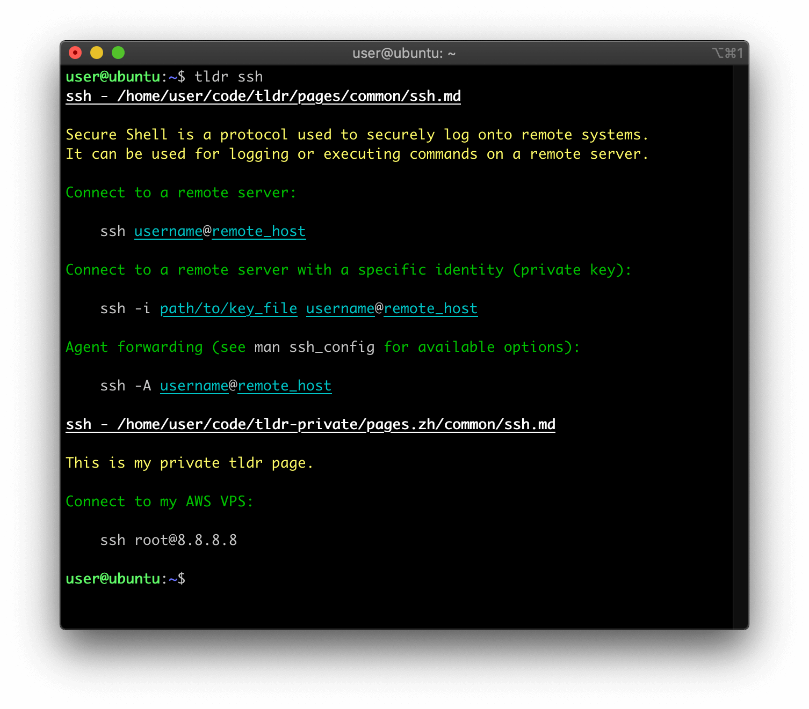

# multi-tldr

Yet another python client for [tldr](https://github.com/tldr-pages/tldr).

Forked and modified from [tldr.py](https://github.com/lord63/tldr.py), whose original idea is very good.

## Intro

tldr.py is a python client for [tldr](https://github.com/tldr-pages/tldr): simplified and community-driven man pages.

Instead of the long man pages:


tldr will give you several simple yet powerful examples:



The command examples are not good? Don't worry, you can set up your own `tldr`! They are just markdown files and you can modify them at your ease. Don't forget to Share them with the community!

One more thing, tldr is just a simple version for the man page, it's **NOT** an alternative. Sometimes, you should read the man pages patiently ;)

## Features highlight

- Use local file, managed and updated by `git`, fast.
- Support custom the output color.

### Differences with `lord63/tldr.py`

- No need to use `tldr find xxxxxx` or alias to `tldr find`, just type `tldr xxxxxx` ([related issue](https://github.com/lord63/tldr.py/issues/47))
- Support display multi repo and multi platform at the same time. You can create your private tldr pages repo.
- Render `{{` and `}}` ([related issue](https://github.com/lord63/tldr.py/issues/25))
- Config file format `YAML` --> `JSON`, because I hate `YAML`.
- Drop support for Python 2.

## Install

```bash
python3 -m pip install git+https://github.com/Phuker/multi-tldr.git
```

## Usage

### Initialize by hand

First, clone the tldr pages repo to somewhere (e.g. `~/code/tldr`). We will use it when we look for a command usage.

```console
$ cd ~/code
$ git clone https://github.com/tldr-pages/tldr.git
```

Then, create the configuration file, the default location for the configuration file is `~/.tldrrc.json`, you can use the `TLDR_CONFIG_DIR` environment variable to point it to another folder (e.g. `$HOME/.config`).

Run this command to generate configuration file and build index:

```console
$ tldr --init
```

Your configuration file should look like this:

```json
{
    "colors":{
        "description": "cyan",
        "usage": "green",
        "command": "white",
        "param": "cyan"
    },
    "platform":[
        "common",
        "osx",
        "linux"
    ],
    "repo_directory":[
        "/home/user/code/tldr",
        "/home/user/code/tldr-private"
    ]
}
```

The `colors` option is for the output when you look for a command, you can custom it by yourself. (Note that the color should be in `['black', 'red', 'green', 'yellow', 'blue', 'magenta', 'cyan', 'white']`)


### Use tldr

look for a command usage:

```console
$ tldr {{command}}
```

Check for updates (so that we can get the latest man pages) and auto reindex:

```console
$ tldr --update
Check for updates in '/home/user/code/tldr' ...
Already up to date.
Check for updates in '/home/user/code/tldr-private' ...
Already up to date.
```

Rebuild the index. This program will find the command via the `index.json`. After a new fresh clone or when you add some new pages, remember to rebuild the index:

```console
$ tldr reindex
Rebuild the index in '/home/user/code/tldr'
Rebuild the index in '/home/user/code/tldr-private'
```

Locate the command man page:

```console
$ tldr --locate {{command}}
```

Or you can use `tldr --help` to get the help message.

## FAQ

**Q: I want to add some custom command usages to a command, how to do it?**
**Q: I want to add some custom command pages, how?**

A: You can contribute to `tldr-pages/tldr`, or create your own repo, and add it to `repo_directory`. Remember to rebuild the index.

**Q: I want a short command like `tldr COMMAND`, not `tldr find COMMAND`.**

A: This problem not exists any more.

**Q: I want fuzzy find command usage.**

A: `tldr list | grep KEYWORD`

**Q: I don't like the default color theme, how to change it?**

A: Edit the tldr configuration file at `~/.tldrrc.json`; modify the color until you're happy with it.

**Q: I faided to update the tldr pages, why?**

A: Actually, `tldr.py` just tries to pull the latest tldr pages for you, no magic behinds it. So the reason why you faided to update is that `tldr.py` failed to pull the latest upstream, check the failing output and you may know the reason, e.g. you make some changes and haven't commit them yet. You can pull the pages by hand so you can have a better control on it.

**Q: Why use the git repo instead of the assets packaged by the official?**

A: In fact, you can use the offical assets if you want, download the assets and extract it somewhere, but `tldr.py` don't support update it using `tldr update`.

Use a `git` repo, you can:

- do the version control, yeah, use `git`.
- better for customization, just edit the pages and add new pages, they belongs to you. You can even maintain your own 'tldr'. If use the official assets, you'll always get the latest pages.

## Contributing

- It sucks? Why not help me improve it? Let me know the bad things.
- Want a new feature? Feel free to file an issue for a feature request.
- Find a bug? Open an issue please, or it's better if you can send me a pull request.

Contributions are always welcome at any time!

## License

MIT.
